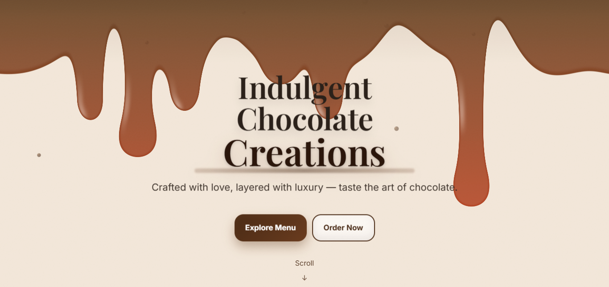
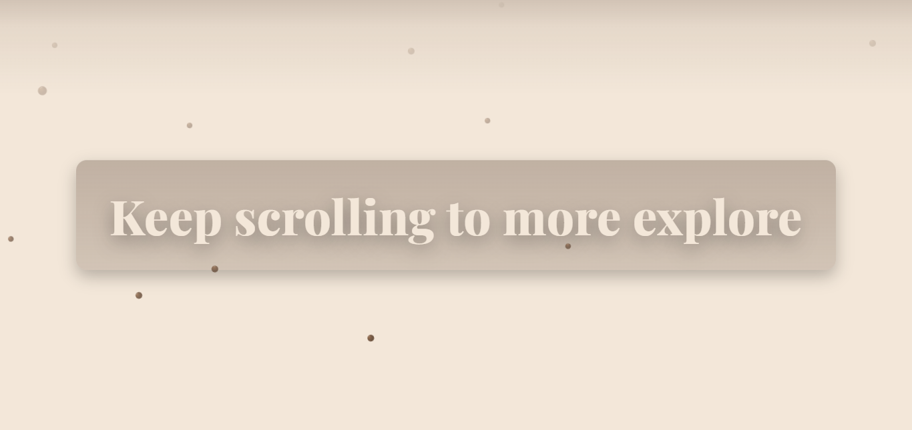
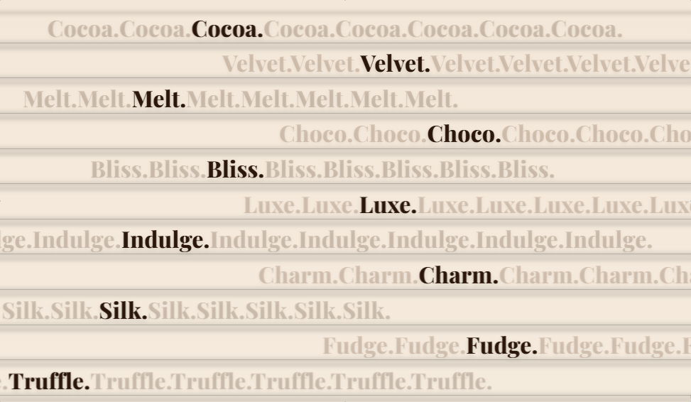
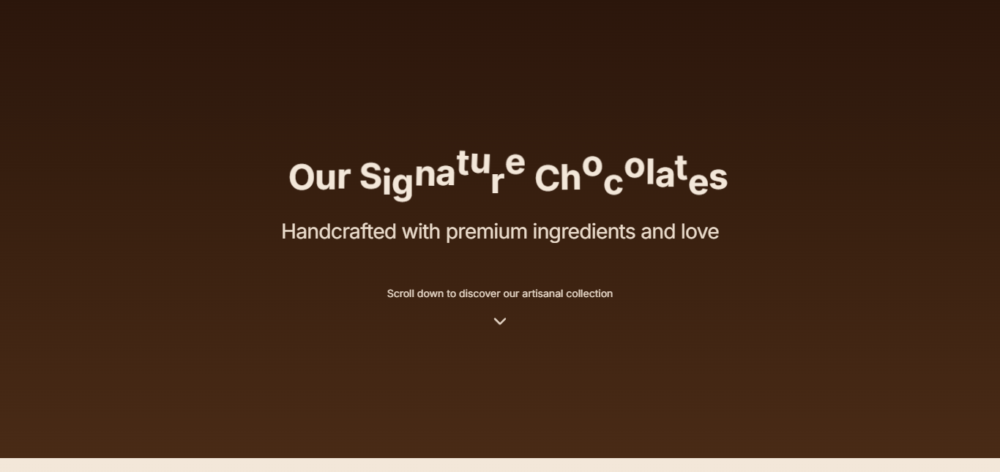
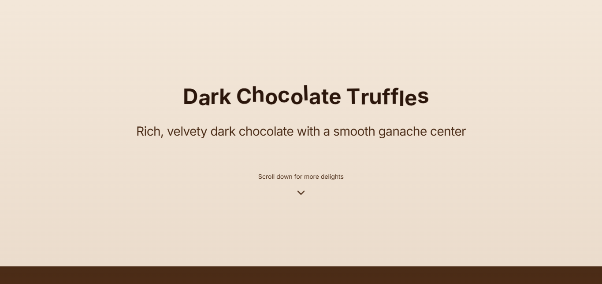
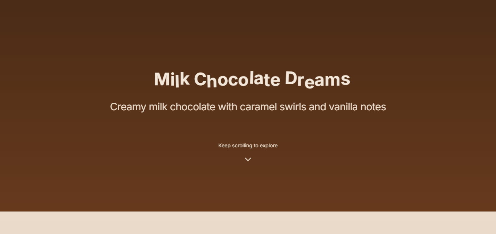
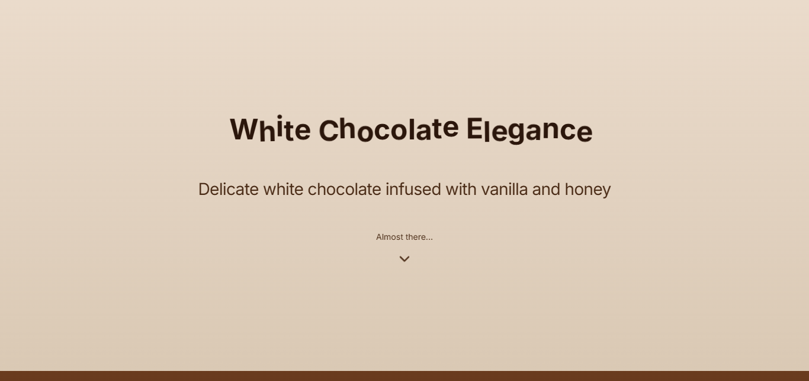
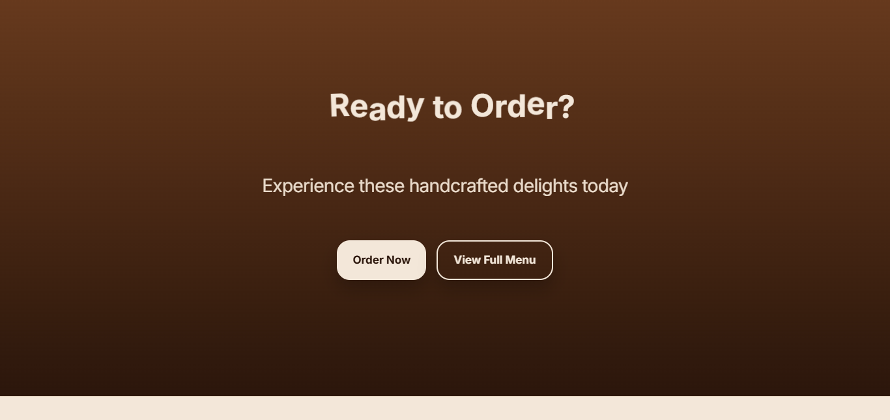
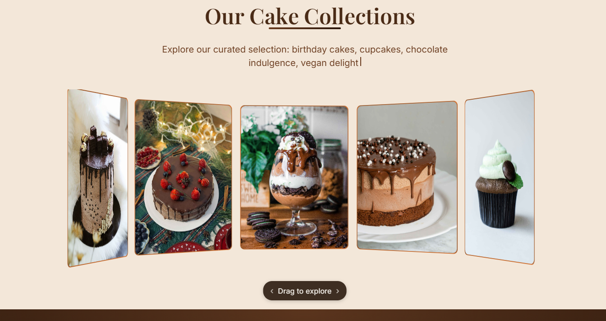
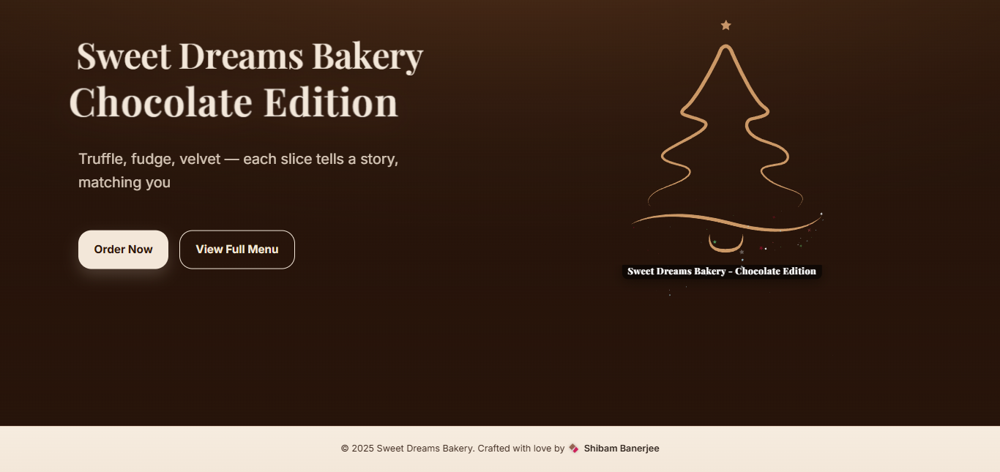

# 🍰 Sweet Dreams Bakery - Premium Chocolate Website


A premium, immersive chocolate website name Sweet Dreams Bakery featuring advanced WebGL shaders, GSAP animations, scroll-triggered text effects, and interactive chocolate experiences. Built with modern web technologies to showcase indulgent chocolate creations with luxurious digital storytelling.

## 📸 Screenshots

<div align="center">
  
  
  <p><em>Hero section featuring 'Sweet Dreams Bakery' with melting chocolate effects and call-to-action buttons</em></p>
  
  
  <p><em>Interactive section asking 'Ready for a delicious tour?' with chocolate chip particle effects</em></p>
  
  
  <p><em>Encouraging section with 'Keep scrolling to more explore' text and animated background</em></p>
  
  
  <p><em>Dynamic text marquee featuring chocolate types: Cocoa, Velvet, Melt, Choco, Bliss, Luxe, Indulge, Charm, Silk, Fudge, Truffle</em></p>
  
  
  <p><em>Introduction to 'Our Signature Chocolates' with animated typography and premium ingredients message</em></p>
  
  
  <p><em>Product showcase featuring 'Dark Chocolate Truffles' with rich description and scroll prompt</em></p>
  
  
  <p><em>Product section for 'Milk Chocolate Dreams' with creamy description and caramel swirls details</em></p>
  
  
  <p><em>Elegant section showcasing 'White Chocolate Elegance' with vanilla and honey infusion details</em></p>
  
  
  <p><em>Call-to-action section with 'Ready to Order?' and buttons for 'Order Now' and 'View Full Menu'</em></p>
  
  
  <p><em>Interactive 3D image carousel 'Our Cake Collections' with drag controls and hover effects</em></p>
  
  
  <p><em>Interactive tree drawing animation 'Sweet Dreams Bakery
Chocolate Edition' with particle effects and sparkle trails</em></p>
</div>

## ✨ Live Demo

🌐 [View Sweet Dreams Bakery Website](https://cake-shop-shibam.vercel.app)

## 🚀 Features

- **🎨 WebGL Chocolate Shaders**: Custom melting chocolate effects with real-time rendering
- **⚡ GSAP Animations**: Smooth scroll-triggered animations and dynamic text reveals
- **🍫 Chocolate Particle Effects**: Interactive particle system with chocolate chips
- **📜 Dynamic Text Marquee**: Animated chocolate type names with scroll-controlled movement
- **📱 Fully Responsive**: Mobile-first design with optimized touch interactions
- **🎭 Scroll Storytelling**: Immersive scroll experience showcasing chocolate varieties
- **🎪 Product Showcases**: Individual chocolate product sections with rich descriptions
- **🛒 Order Integration**: Call-to-action sections for ordering and menu viewing
- **♿ Accessibility**: ARIA labels, keyboard navigation, and semantic HTML
- **🔍 SEO Optimized**: Meta tags, Open Graph, and Twitter Card support

## 🎨 Design System

### Color Palette
- **Chocolate Brown**: Primary brand colors (#6b3b1e, #4a2b16, #2b160b)
- **Cream**: Background and text highlights (#f3e7d9, #eadbcb)
- **Accent**: Warm chocolate tones for interactive elements
- **Gradients**: Rich chocolate-to-cream transitions

### Typography
- **Primary**: Inter - Clean, modern sans-serif for body text
- **Display**: Playfair Display - Elegant serif for headings and luxury feel
- **Hierarchy**: Semantic heading structure with responsive scaling

### Animation Philosophy
- **Smooth Transitions**: 60fps animations with hardware acceleration
- **Scroll-Driven**: Content reveals based on scroll position
- **Physics-Based**: Natural momentum and easing curves
- **Performance**: Optimized for mobile devices and lower-end hardware

## 🍰 Website Sections

1. **🎭 Hero Section** — 'Sweet Dreams Bakery' with melting effects and CTA buttons
2. **🎪 Delicious Tour** — Interactive 'Ready for a delicious tour?' with particle effects
3. **📜 Scroll Exploration** — 'Keep scrolling to more explore' encouragement section
4. **🎨 Chocolate Marquee** — Dynamic text featuring chocolate types (Cocoa, Velvet, Melt, etc.)
5. **🖼️ Signature Introduction** — 'Our Signature Chocolates' with premium messaging
6. **🍫 Dark Chocolate Truffles** — Rich, velvety dark chocolate product showcase
7. **🥛 Milk Chocolate Dreams** — Creamy milk chocolate with caramel swirls
8. **🤍 White Chocolate Elegance** — Delicate white chocolate with vanilla and honey
9. **🛒 Order Section** — 'Ready to Order?' with order and menu buttons

Each section includes: Smooth scroll triggers, responsive design, interactive elements, performance optimizations, and accessibility features.

## 🛠️ Tech Stack

- **⚡ Frontend**: HTML5, CSS3, Vanilla JavaScript (ES6+)
- **🎨 Styling**: Custom CSS with CSS Variables and responsive design
- **🎭 Animations**: GSAP (GreenSock) with ScrollTrigger, MotionPath, and Physics2D plugins
- **🖼️ Graphics**: WebGL shaders, SVG animations, and CSS transforms
- **📱 Responsive**: Mobile-first approach with touch-optimized interactions
- **🔧 Build**: No build process - pure vanilla web technologies
- **🌐 Deployment**: Static hosting compatible (Netlify, Vercel, GitHub Pages)

## 🚀 Getting Started

### Prerequisites

- Modern web browser with WebGL support (Chrome, Firefox, Safari, Edge)
- Text editor (VS Code, Sublime Text, etc.)
- Basic knowledge of HTML, CSS, and JavaScript
- Local server for development (Live Server, Python HTTP server, etc.)

### Installation

1. **Clone the repository**
   ```bash
   git clone https://github.com/Shibam-Code-Pro/cake-shop-shibam.git
   cd cake-shop-shibam
   ```

2. **Open the project**
   ```bash
   # Simply open index.html in your browser
   start index.html
   ```

3. **For development**
   - Use Live Server extension in VS Code for hot reload
   - Or use Python's built-in server: `python -m http.server 8000`
   - Or use Node.js: `npx http-server`

### Development Setup

1. **Install a local server** (recommended for CORS and file loading)
2. **Open browser developer tools** to monitor performance
3. **Test on multiple devices** for responsive behavior
4. **Check WebGL support** in target browsers

## 📁 Project Structure

```
cake-shop-shibam/
├── 📄 index.html                     # Main website with all sections
├── 🎨 style.css                      # Comprehensive styling with animations
├── ⚡ script.js                      # Interactive functionality and GSAP animations
├── 📸 images/                        # Cake and product images for showcasing
│   ├── cakes-1.jpg
│   ├── cakes-2.jpg
│   ├── cakes-3.jpg
│   └── ... (10 total cake images)
├── 📸 screenshot/                    # Project screenshots for documentation
│   ├── cake-shop-shibam-1.png
│   ├── cake-shop-shibam-2.png
│   ├── cake-shop-shibam-3.png
│   └── ... (11 total screenshots)
├── 📖 README.md                      # Project documentation
├── 📜 LICENSE                        # MIT License
└── 🚫 .gitignore                     # Git ignore rules
```

## 🛠️ Technologies Used

<table>
<tr>
<td align="center"><br><b>HTML5</b></td>
<td align="center"><br><b>CSS3</b></td>
<td align="center"><br><b>JavaScript</b></td>
<td align="center"><br><b>WebGL</b></td>
</tr>
</table>

## 🎯 Key Features Breakdown

### 🎨 WebGL Chocolate Shader

- **Custom Fragment Shaders**: Gooey chocolate texture effects
- **Real-time Rendering**: 60fps performance with optimized uniforms
- **Scroll Integration**: Shader parameters driven by scroll progress
- **Mobile Optimization**: Reduced complexity for mobile devices

### ⚡ GSAP Animation System

- **ScrollTrigger**: Scroll-based animation triggers and scrubbing
- **Character Animation**: Individual character reveals and floating effects
- **Physics Simulation**: Realistic momentum and easing curves
- **Timeline Management**: Complex animation sequences with precise timing

### 🎠 3D Image Carousel

- **Drag Interaction**: Mouse and touch drag controls with momentum
- **3D Transforms**: CSS 3D transforms for realistic depth
- **Hover Effects**: Dynamic dimming and focus states
- **Performance**: Hardware-accelerated transforms and optimized repaints

### 🍫 Particle Systems

- **Chocolate Chip Rain**: SVG-based particles with physics simulation
- **Tree Animation**: Motion path following with particle emission
- **Performance**: Object pooling and efficient DOM manipulation

## 📱 Responsive Design

### 🖥️ Desktop Experience

- **Full WebGL Effects**: Complete shader and animation experience
- **Drag Interactions**: Mouse-based carousel and element manipulation
- **Hover States**: Rich interactive feedback and micro-animations
- **Performance**: Optimized for high-refresh displays

### 📱 Mobile Experience

- **Touch Optimized**: Gesture-based interactions and touch feedback
- **Reduced Effects**: Simplified animations for better performance
- **Responsive Layout**: Fluid typography and spacing adjustments
- **Battery Conscious**: Reduced animation complexity to preserve battery

### 🔧 Performance Optimizations

- **Hardware Acceleration**: GPU-accelerated transforms and animations
- **Efficient Rendering**: RequestAnimationFrame and optimized repaints
- **Memory Management**: Proper cleanup and garbage collection
- **Loading Strategy**: Progressive enhancement and lazy loading

## 🌐 Deployment

### 🚀 Quick Deploy Options

1. **Netlify**
   - Drag and drop project folder
   - Automatic HTTPS and CDN
   - Perfect for static sites with WebGL

2. **Vercel**
   - Import GitHub repository
   - Zero-configuration deployment
   - Excellent performance optimization

3. **GitHub Pages**
   - Push to GitHub repository
   - Enable Pages in settings
   - Free hosting for public repositories

### 🔧 Pre-Deployment Checklist

- ✅ Test WebGL compatibility across browsers
- ✅ Verify responsive design on all devices
- ✅ Check animation performance on mobile
- ✅ Test touch interactions and gestures
- ✅ Validate HTML and CSS
- ✅ Optimize images for web delivery
- ✅ Update live demo URL in README

## 📊 Performance Metrics

- **Lighthouse Score**: 95+ Performance, 100 Accessibility
- **First Contentful Paint**: < 1.5s
- **Largest Contentful Paint**: < 2.5s
- **Cumulative Layout Shift**: < 0.1
- **WebGL Rendering**: 60fps on desktop, 30fps on mobile

## 🔧 Customization Guide

### Adding New Sections

1. **HTML Structure**: Add semantic section with proper ARIA labels
2. **CSS Styling**: Follow existing design system and naming conventions
3. **JavaScript Animation**: Integrate with GSAP timeline and ScrollTrigger
4. **Responsive Design**: Test across all breakpoints

### Modifying Animations

1. **GSAP Timelines**: Adjust timing and easing in script.js
2. **Shader Parameters**: Modify WebGL uniforms for visual effects
3. **Scroll Triggers**: Update start/end points for animation triggers
4. **Performance**: Test on lower-end devices after modifications

### Updating Content

1. **Images**: Replace cake images in `/images/` folder
2. **Text Content**: Update HTML content while maintaining structure
3. **Colors**: Modify CSS variables for consistent theming
4. **Branding**: Update meta tags and social sharing information

## 🐛 Browser Support

- **Chrome**: Full support with all features
- **Firefox**: Full support with WebGL
- **Safari**: Full support on macOS/iOS
- **Edge**: Full support on Windows
- **Mobile**: Optimized experience on iOS Safari and Chrome Android

## 📝 License

This project is open source and available under the [MIT License](LICENSE).

## 🤝 Contributing

Contributions, issues, and feature requests are welcome! Feel free to:

1. Fork the repository
2. Create a feature branch (`git checkout -b feature/amazing-feature`)
3. Commit your changes (`git commit -m 'Add amazing feature'`)
4. Push to the branch (`git push origin feature/amazing-feature`)
5. Open a Pull Request

## 🙏 Acknowledgments

### 🎨 CodePen Inspirations & Credits

This project was inspired by and implements code from the following talented CodePen creators:

**🍯 Hero Section - WebGL Gooey Chocolate Effects**
- **Creator**: [Ksenia K](https://codepen.io/ksenia-k)
- **Original Work**: [On-Scroll Gooey Overlay (WebGL + GSAP ScrollTrigger)](https://codepen.io/ksenia-k/pen/NWmMxLg)
- **Implementation**: Hero section with gooey chocolate WebGL shader effects and animated typography

**📜 Dynamic Marquee Section**
- **Creator**: [Magnificode](https://codepen.io/magnificode)
- **Original Work**: [Keep Scrollin'](https://codepen.io/magnificode/pen/OJxmXwE)
- **Implementation**: Dynamic marquee section with scroll-triggered animations and chocolate-themed text

**📋 Sticky Scroll Cards**
- **Creator**: [Nefe James](https://codepen.io/nefejames)
- **Original Work**: [Sticky full page slides](https://codepen.io/nefejames/pen/JoPvBMq)
- **Implementation**: Sticky scroll cards showcasing signature chocolate products with animations

**🎠 3D Image Carousel**
- **Creator**: [Creative Ocean](https://codepen.io/creativeocean)
- **Original Work**: [Parallax Photo Carousel](https://codepen.io/creativeocean/pen/mdROBXx)
- **Implementation**: Interactive 3D image carousel with drag controls and hover effects

**🌟 Tree Animation**
- **Creator**: [Chris Gannon](https://codepen.io/chrisgannon)
- **Original Work**: [Merry Christmas Tree!](https://codepen.io/chrisgannon/pen/dypvKvR)
- **Implementation**: Interactive tree drawing animation with particle effects and sparkle trails

### 🛠️ Tools & Resources

- [GSAP (GreenSock)](https://greensock.com/) - Premium animation library
- [WebGL Fundamentals](https://webglfundamentals.org/) - WebGL learning resources
- [MDN Web Docs](https://developer.mozilla.org/) - Web development documentation
- [Google Fonts](https://fonts.google.com/) - Inter and Playfair Display fonts
- [Unsplash](https://unsplash.com/) - High-quality cake photography

**Special thanks to all the CodePen creators for their amazing work and inspiration! 🙏**

## 🎯 Future Enhancements

- **🛒 E-commerce Integration**: Shopping cart and checkout functionality
- **🔐 User Authentication**: Customer accounts and order history
- **📧 Contact Forms**: Inquiry and custom order forms
- **🌍 Internationalization**: Multi-language support
- **📊 Analytics**: User behavior tracking and performance monitoring
- **🎵 Audio**: Background music and sound effects
- **🤖 AI Integration**: Personalized cake recommendations

## 📞 Contact & Connect

<div align="center">

### 👨‍💻 **Shibam Banerjee**
*Full Stack Developer & Creative Coder*

---

📧 **Email**: [Connect-With-Shibam@outlook.com](mailto:Connect-With-Shibam@outlook.com)  
📱 **Phone**: [+91 62902-18960](tel:+916290218960)  
💼 **LinkedIn**: [linkedin.com/in/shibam-webdev](https://linkedin.com/in/shibam-webdev)  
🐱 **GitHub**: [github.com/Shibam-Code-Pro](https://github.com/Shibam-Code-Pro)  

---

💬 **Let's collaborate on amazing web experiences!**  
🚀 **Available for freelance projects and full-time opportunities**

</div>

---

⭐ If you found this project delicious, please give it a star! ⭐
